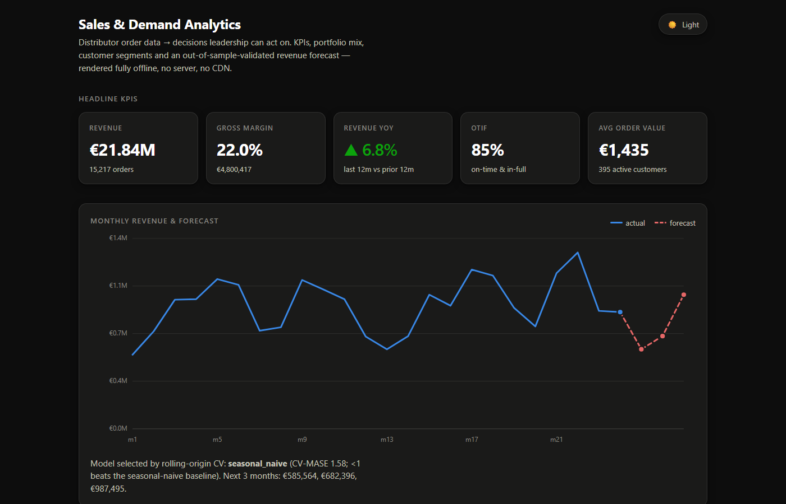
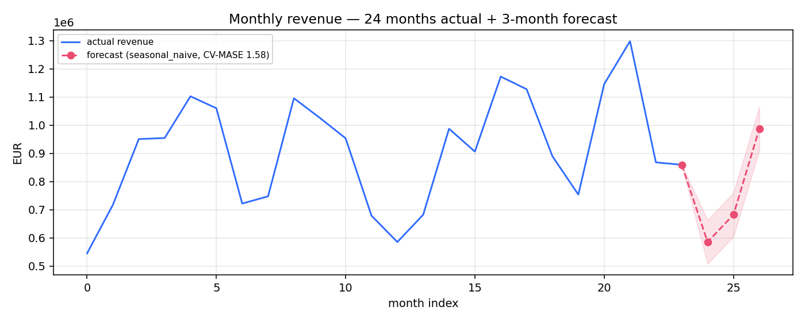

# Sales & Demand Analytics

I wanted a portfolio piece that looked like the actual work a distributor's
data/BI team does — not a Kaggle notebook. So this takes 24 months of B2B
wholesale order data and turns it into the things leadership actually asks for:
KPIs, a margin bridge, an ABC-XYZ portfolio view, RFM customer segments, a demand
forecast that's been validated out-of-sample, a replenishment buy-list, and a
polished executive review you could drop in front of a management team.



The analytics core is **pure Python standard library** — `csv`, `sqlite3`,
`statistics`, `json`. No pandas, no numpy. That was a deliberate constraint:
partly to keep it dependency-light, partly because writing MASE, Croston's method
and Holt-Winters from scratch forces you to actually understand them. `openpyxl`
and `matplotlib` are the only third-party packages, and only for the Excel and
chart/PDF outputs — everything else runs on a bare Python install.

**Business case:** it turns a €21.8M-revenue distributor's 24 months of orders into
the QBR decisions leadership actually acts on — including the **€2.6M/year discount
leakage** the current process leaves unmanaged. See
[`docs/BUSINESS_CASE.md`](docs/BUSINESS_CASE.md) for the situation, the quantified
problem and the ROI.



© 2026 Dimitres Kisimov — all rights reserved; published for portfolio review. See LICENSE. · Python 3.10–3.12 · stdlib core

## Run it

```bash
python scripts/generate_data.py        # writes data/sales_transactions.csv
python -m saleskpi --deliverables       # runs everything, writes deliverables/
python scripts/make_presentation.py     # builds the executive review PDF/PPTX
```

Then open `web/index.html` in a browser — the dashboard is offline, no server,
no CDN (run `python scripts/build_web_data.py` first if you regenerated the data).
`python -m saleskpi --sql` runs the SQL side.

## What comes out (`deliverables/`)

- **`executive_review.pdf`** — the headline. An 8-slide Executive Business Review
  (title, KPI scorecard, revenue+forecast, margin bridge, ABC-XYZ, expenditure,
  RFM + at-risk callout, recommended actions). Also emits `executive_review.pptx`
  if `python-pptx` is installed.
- **`management_report.md`** — the same story as a written QBR.
- **`kpi_workbook.xlsx`** — multi-sheet Excel (KPIs, mix, ABC-XYZ, RFM, forecasts,
  reorder list, spend).
- **`reorder_list.csv`** — region×category cells below their reorder point, with
  order quantities.
- **`analysis.json`** — everything, machine-readable (also feeds the dashboard).
- **`forecast.png`** — the chart above.

## How the pieces fit

| Module | Does |
|---|---|
| `dataset.py` | typed CSV load + monthly-series / group-by helpers |
| `metrics.py` | KPIs, growth, mix, ABC-XYZ, RFM, concentration, margin bridge |
| `forecast.py` | 7 forecasters, MASE/RMSE/…, rolling-origin CV, model selection |
| `inventory.py` | safety stock, reorder point, GMROI, reorder recommendations |
| `spend.py` | COGS split, discount leakage, returns cost, cost-to-serve |
| `sqlq.py` | loads the data into in-memory SQLite for the SQL queries |
| `report.py` | runs the pipeline and writes the deliverables |

The maths and the conventions (why MASE, the ABC cutoffs, the PVM bridge, the
safety-stock formula) are written up in [docs/METHODOLOGY.md](docs/METHODOLOGY.md),
and there's a full QBR walkthrough in [docs/USE_CASE.md](docs/USE_CASE.md).

## A few honest notes

- **The forecast MASE is above 1 on this data, and I don't hide it.** With only 24
  monthly points, seasonal-naive is a brutally strong baseline — beating it needs
  more history or SKU-level series. The point I wanted to demonstrate is the
  *honest evaluation* (rolling-origin CV, scale-free scoring), not a hero number.
  The report prints the CV-MASE next to every forecast so you can judge it.
- **The fiddly part was the margin bridge.** Getting price/volume/mix to reconcile
  exactly to the total change (so `price + volume + mix == total`, which a test
  now enforces) took a couple of tries — the mix term has to be the residual or
  the numbers don't tie out.
- **The returns cost is a model, not a measurement** — `rate × avg cost`, because
  the synthetic data doesn't carry restocking cost. Labelled as such everywhere.
- **The SQL↔Python cross-check** is my favourite test: the revenue-by-region
  rollup is computed both ways and asserted equal to the cent, so the two engines
  can't drift apart silently.

## What I'd add next

Real (or longer) history so the smarter forecasters can actually earn their keep;
SKU-grain instead of category-grain forecasting; prediction intervals on the
forecast; and wiring the reorder recommendations to an actual lead-time
distribution per supplier instead of a flat one-month assumption.

## Data & scope

The dataset is **100% synthetic**, generated deterministically by
`scripts/generate_data.py` — no real company or customer (details in
[CREDITS.md](CREDITS.md)). Tests are key-free and run on the generated data.

I built this while applying for a **Data & AI Analytics** internship at Würth —
the role is squarely BI / KPI reporting / predictive analytics for a distributor,
which is exactly the shape of this project. © 2026 Dimitres Kisimov — all rights reserved; published for portfolio review. See LICENSE.
